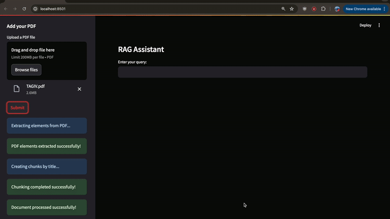

# Multi-Modal RAG Application

This repository contains end-to-end projects for multi-modal RAG applications.

## Project 1: Visual Question & Answering on a PDF Document (LangChain + GPT-4o + Streamlit)



### Context

In this code, I'll guide you through building a multi-modal RAG chat application using OpenAI's GPT-4o model. This application will enable visual question answering by retrieving information from a PDF document, parsing through text, tables, and images seamlessly. We'll also evaluate the chatbot's performance using various metrics available through the DeepEval library.

### Directory Structure

```plaintext
advanced-RAG-app/
│
├── utils/
│   ├── __init__.py
│   ├── image_processing.py
│   ├── rag_chain.py
│   ├── rag_evaluation.py
│   └── retriever.py
│
└── main.py
└── requirements.txt

```

### Prerequisites

Before you begin, please make sure you have met the following requirements:

- python==3.10
- An openai_api_key

### Installation

1. Clone this repository to your local machine using:

```bash
git clone https://github.com/bhargobdeka/advanced-RAG-app
cd advanced-RAG-app
```

2. Open VScode and set up virtual environment

```bash
python3.10 -m venv venv
```

3. Install the python libraries:

```bash
pip install -r requirements.txt
```

4. Install Tesseract and Poppler using Homebrew

```bash
brew install tesseract
brew install poppler
```

### Run the Application

Run the application using

```bash
streamlit run main.py
```
